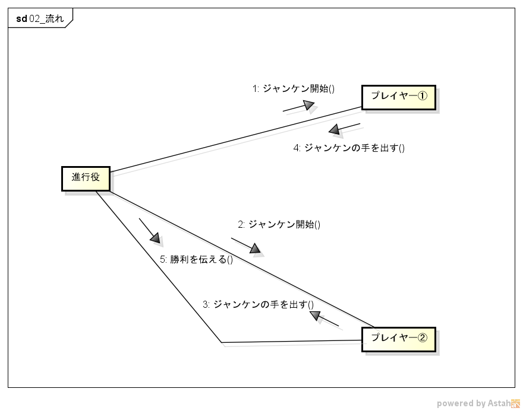
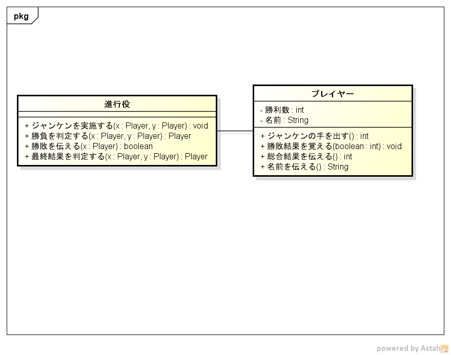
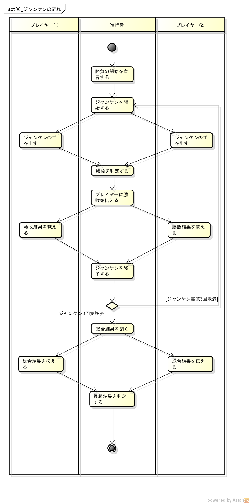
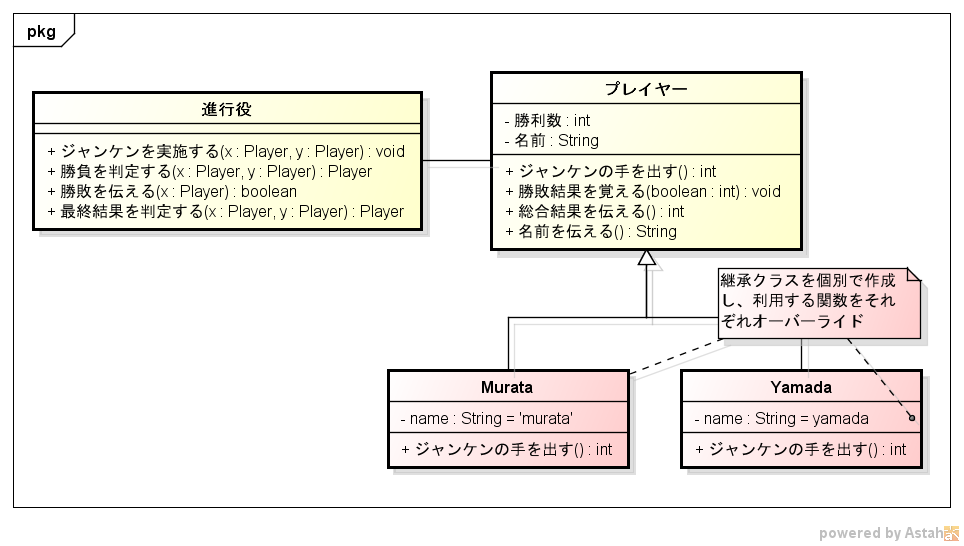
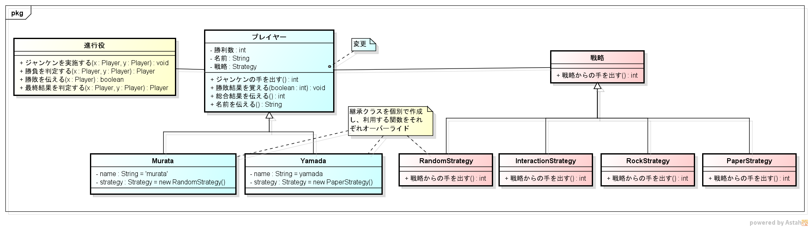

# OOD

OOD(object-oriented development) learning for Python.

## Table of contents

* [Lesson1](#Lesson1)
* [Lesson2](#Lesson2)
* [Lesson3](#Lesson3)
* [Lesson4](#Lesson4)

## Lesson1

### 概要

* べた書き実装

```
[vagrant@localhost lesson1]$ mkvirtualenv --python=/usr/bin/python3.6 lesson1
(lesson1) [vagrant@localhost lesson1]$ vi SimpleJanken.py
(lesson1) [vagrant@localhost lesson1]$ python SimpleJanken.py
```

```
--- ジャンケン開始 ---

第1回目
player1 [PAPER] VS player2 [PAPER]
->result:両者引き分け

第2回目
player1 [ROCK] VS player2 [PAPER]
->result:player2の勝利

第3回目
player1 [PAPER] VS player2 [ROCK]
->result:player1の勝利

--- ジャンケン終了---

--- 最終結果---
勝利数：player1:1回、player2:1回
両者引き分け

```

### UML適用

* アクティビティ図`を用いて処理手順を明確にする

## Lesson2

### 概要

* 仕様追加への対応
  * [外部仕様] 任意の名前を表示できるようにする
* オブジェクト指向プログラム実装
  * クラス、インスタンスの利用

```
(lesson2) [vagrant@localhost lesson2]$ python OOD_Janken.py
```

```
--- ジャンケン開始 ---

第1回目
player1(murata) [PAPER] VS player2(yamada) [SCISSORS]
->result:player2(yamada)の勝利

第2回目
player1(murata) [ROCK] VS player2(yamada) [SCISSORS]
->result:player1(murata)の勝利

第3回目
player1(murata) [ROCK] VS player2(yamada) [SCISSORS]
->result:player1(murata)の勝利

--- ジャンケン終了---

--- 最終結果---
勝利数：player1:2回、player2:1回
player1(murata)の勝利

```

### UML適用

* コミュニケーション図で操作や流れを洗い出す
  * 
* クラス図での操作と属性の洗い出す
  * 
* アクティビティ図での処理手順の明確にする
  * 

## Lesson3

### 概要

* 仕様追加への対応
  * [外部仕様]プレイヤー毎に手の出し方を変えることができる
* オブジェクト指向プログラム実装
  * 継承の利用

```
(lesson3)[vagrant@localhost lesson2]$ python OOD_Janken.py
--- ジャンケン開始 ---

第1回目
player1(murata) [PAPER] VS player2(yamada) [PAPER]
->result:両者引き分け

第2回目
player1(murata) [PAPER] VS player2(yamada) [PAPER]
->result:両者引き分け

第3回目
player1(murata) [PAPER] VS player2(yamada) [PAPER]
->result:両者引き分け

--- ジャンケン終了---

--- 最終結果---
勝利数：player1:0回、player2:0回
両者引き分け

```

### UML適用

* クラス図で継承の関係を明確にする
  * 

## Lesson4

### 概要

* 仕様追加への対応
  * [外部仕様]手の出し方を後で追加できるようにする
* オブジェクト指向プログラム実装
  * 新規クラスの追加、既存クラス操作の変更

### UML適用

* クラス図で継承の関係を明確にする
* クラス図で新規クラスとの関係を明確にする
  * 

## オブジェクト指向設計手順

| 手順|  内容 　　　　　　　　　　　 | 利用モデル(あくまで参考) |
| --- | ------------------------  |---------------|
|  ①  |  利用シーンをシナリオ化する  |テキスト,ユースケース図/記述|
|  ②  |  クラスの抽出する           |クラス図|
|  ③  |  関連の洗い出す             |クラス図|
|  ④  |  メッセージを検討する       |コミュニケーション図|
|  ⑤  |  操作の洗い出す             |クラス図|
|  ⑥  |  属性の洗い出す             |クラス図,アクティビティ図|
|  ⑦  |  シーケンスの検討する        |シーケンス図|

## Reference

* `なぜ，あなたはJavaでオブジェクト指向開発ができないのか`
  * http://gihyo.jp/book/2005/4-7741-2222-X
